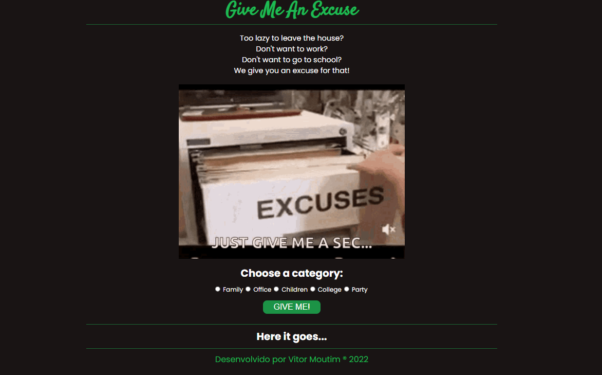

# Project Give Me An Excuse

### A API usada nesse projeto foi 'Excuser API : One spot to find all excuses !'

#### Link da API: https://excuser.herokuapp.com/

O site consiste em te dar uma desculpa para determinada categoria.

Selecione uma categoria dentre as disponiveis e clique em 'GIVE ME'. A desculpa aparecerá abaixo.

As categorias disponiveis são: 

* Family
* Office
* Children
* College
* Party

[Acessar](https://moutim.github.io/projectGiveMeAnExcuse/)

